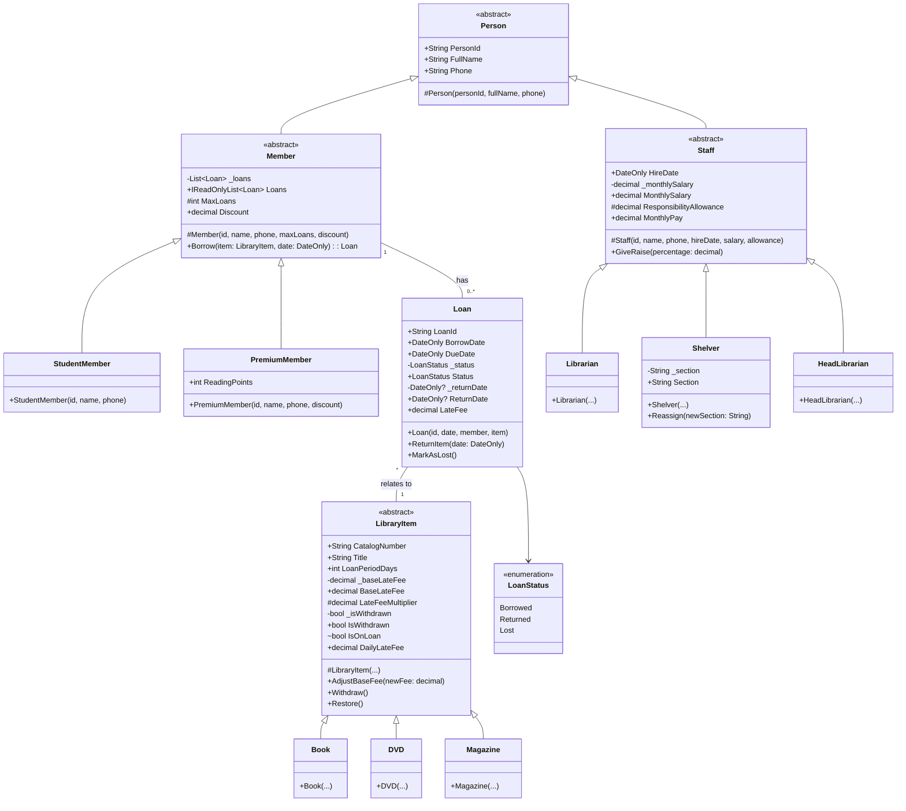

# Library System Class Diagram

```mermaid
classDiagram
    class Person {
        <<abstract>>
        +String PersonId
        +String FullName
        +String Phone
        #Person(personId, fullName, phone)
    }

    class Member {
        <<abstract>>
        -List~Loan~ _loans
        +IReadOnlyList~Loan~ Loans
        #int MaxLoans
        +decimal Discount
        #Member(id, name, phone, maxLoans, discount)
        +Borrow(item: LibraryItem, date: DateOnly): Loan
    }
    
    class StudentMember {
        +StudentMember(id, name, phone)
    }
    
    class PremiumMember {
        +int ReadingPoints
        +PremiumMember(id, name, phone, discount)
    }

    class Staff {
        <<abstract>>
        +DateOnly HireDate
        -decimal _monthlySalary
        +decimal MonthlySalary
        #decimal ResponsibilityAllowance
        +decimal MonthlyPay
        #Staff(id, name, phone, hireDate, salary, allowance)
        +GiveRaise(percentage: decimal)
    }

    class Librarian {
        +Librarian(...)
    }

    class Shelver {
        -String _section
        +String Section
        +Shelver(...)
        +Reassign(newSection: String)
    }

    class HeadLibrarian {
        +HeadLibrarian(...)
    }

    class LibraryItem {
        <<abstract>>
        +String CatalogNumber
        +String Title
        +int LoanPeriodDays
        -decimal _baseLateFee
        +decimal BaseLateFee
        #decimal LateFeeMultiplier
        -bool _isWithdrawn
        +bool IsWithdrawn
        ~bool IsOnLoan
        +decimal DailyLateFee
        #LibraryItem(...)
        +AdjustBaseFee(newFee: decimal)
        +Withdraw()
        +Restore()
    }

    class Book {
        +Book(...)
    }

    class DVD {
        +DVD(...)
    }

    class Magazine {
        +Magazine(...)
    }

    class LoanStatus {
        <<enumeration>>
        Borrowed
        Returned
        Lost
    }

    class Loan {
        +String LoanId
        +DateOnly BorrowDate
        +DateOnly DueDate
        -LoanStatus _status
        +LoanStatus Status
        -DateOnly? _returnDate
        +DateOnly? ReturnDate
        +decimal LateFee
        +Loan(id, date, member, item)
        +ReturnItem(date: DateOnly)
        +MarkAsLost()
    }

    Person <|-- Member
    Person <|-- Staff
    Member <|-- StudentMember
    Member <|-- PremiumMember
    Staff <|-- Librarian
    Staff <|-- Shelver
    Staff <|-- HeadLibrarian
    LibraryItem <|-- Book
    LibraryItem <|-- DVD
    LibraryItem <|-- Magazine

    Member "1" -- "0..*" Loan : has
    Loan "*" -- "1" LibraryItem : relates to
    Loan --> LoanStatus
```
